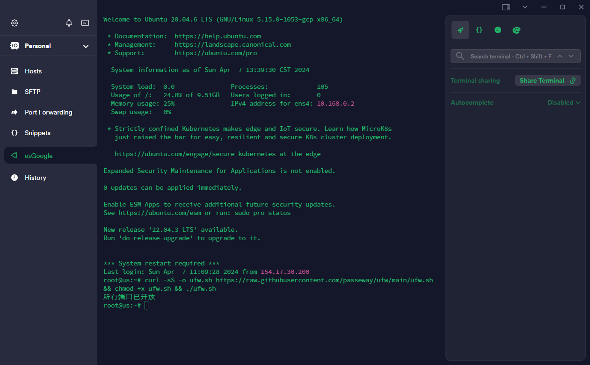

## 预览




## 一键脚本
```
bash <(curl -fsSL ufw-eight.vercel.app)
```
## 项目概述
这段脚本的作用是关闭和禁用防火墙服务（firewalld），关闭 SELinux，禁用 UFW 防火墙，设置 iptables 规则允许所有传入、转发和输出的流量，并且清除所有的 iptables 规则，最后保存 iptables 规则以防止重启后丢失。

## 详细说明
- 停止并禁用 firewalld 服务：停止并禁用当前运行的 firewalld 服务，如果存在的话。

- 关闭 SELinux：将 SELinux 设置为“permissive”模式，这意味着 SELinux 仍然会记录违例，但不会阻止任何操作。

- 禁用 UFW 防火墙：停止并禁用 UFW 防火墙服务。

- 设置 iptables 规则允许所有传入、转发和输出的流量：将 iptables 的默认策略设置为允许所有传入、转发和输出的流量。

- 清除 iptables 的 mangle 表和所有链的规则：清除所有 iptables 的规则和链。

- 保存 iptables 规则以防止重启后丢失：使用 netfilter-persistent 工具保存当前的 iptables 规则。


